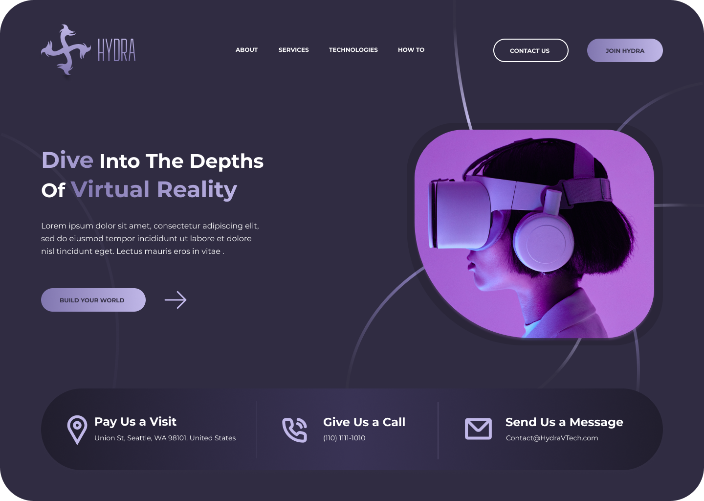
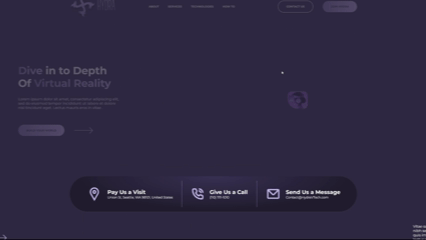

# HydraLandong

## 🎬 Демонстрация проекта

  

## Технологии

Проект разработан с использованием следующих технологий:

- **HTML**: Для структуры и разметки страницы.
- **CSS/SCSS**: Для стилей и улучшенной возможности организации стилей с помощью Sass.
- **JavaScript (JS)**: Для добавления динамического поведения и взаимодействия на стороне клиента.
- **GSAP (GreenSock Animation Platform)**: Для создания красивых анимаций и эффектов.

## Адаптивность и Кроссбраузерность

Лендинг полностью адаптивен и кроссбраузерен, что обеспечивает комфортное отображение на различных устройствах и в разных браузерах.

### Адаптивность

Все компоненты лендинга адаптированы для отображения на различных экранах, включая мобильные устройства, планшеты и настольные компьютеры.

### Кроссбраузерность

Лендинг протестирован и оптимизирован для работы в следующих браузерах:

- Google Chrome
- Mozilla Firefox
- Microsoft Edge
- Safari
- Другие современные браузеры

## Как использовать

1. Склонируйте репозиторий: `git clone https://github.com/ваш-локальный-путь.git`.
2. Откройте файл `index.html` в вашем браузере.

